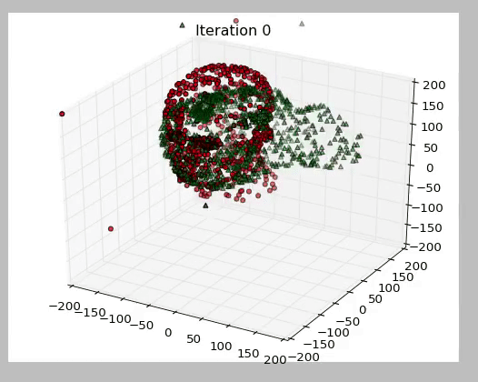

# Advanced Techniques for Curve Fitting


## Introduction
Curve fitting often occurs in lot of situation. It is possible to simple
linear fitting of the data. The most commonly used way is the linear least squares.
However, it is quite sensitive to outliers. It is important to distinguish
outliers from noise. Both have totally different effects on the quality of the solution.

It is also often the case to fit a complicated non-linear function to the data.
[ceres-solver](http://ceres-solver.org/index.html) is a fantastic library from
google for non-linear least squares. It uses functional programming to elegantly
let you specify your non-linear least squares problem. ceres-solver is a
2nd order solver, which means it is roughly based on the Gauss-Newton method
as opposed to Gradient Descent methods. ceres-solver's main purpose is to
use it for function optimization in SLAM community. The main feature that
distinguish it from other general solvers is its ability to optimize on the
manifold. For example, it is produce solution on the SO(3) manifold (ie.
  spaces of rotation matrix).


## Problems
I am attempting to solve 2 problems. This data will have outliers in addition to noise:
- 1d linear fit (given a Nx2 matrix get equation of a line). 2 parameters.
- Quadratic fit. Given Nx2 matrix fit a quadratic equation. 3 parameters.
- SO(3) + R^3 fit. Given two point cloud to estimate the translation and rotation between them.
  7 parameters (quaternion and 3 translations) but really 6 parameters.

## Methods
I shall explore the following techniques to solve the above problem:
- Basic least squares
- Use of Robust norms (Huber Norm and Cauchy Norm)
- L1 norm and linear-programming
- Use of Switch Variables
- Use of Dynamic Covariance Scalling
- BigM trick. See luca carlone's paper on SLAM (L. Carlone and G. Calafiore. Convex Relaxations for Pose Graph Optimization with Outliers. IEEE Robotics and Automation Letters (RA-L), 3(2):1160–1167, 2018) 
- Using the truncated least squares ($f_c = min(x^2, c^2);$, c is a constant. However often this is non-differentiable, there are 2 ways to deal with this
  - Use, $f_c \approx \frac{x^2}{ (c^2 + x^2) }$ also called  Geman-McClure cost function.
  - Use, $f_c = \frac{1}{2} (1+\theta) x^2 + \frac{1}{2} (1-\theta) c^2 $, c is a constant and theta is a descrete optimization variable taking the values ${1;-1}$. This paper, https://arxiv.org/pdf/1810.11692.pdf, uses this trick. 
  - 


## Note
I shall use the ceres-solver's C++ interface for this. Plotting tools are implemented
in Python and are in `plotting` directory. Methods using python are found in `py` directory.


# How to Run
You need to have Eigen (Linear Algebra Library) and ceres-solver installed.

```
mkdir build
cd build
cmake ..
make
```

## Result Gallery
Alignment of 2 pointclouds. No noise added.


## Further Examples 
Have a look at this repo: https://github.com/superjax/ceres_sandbox for more practical and slam related examples with CERES-solver. 
